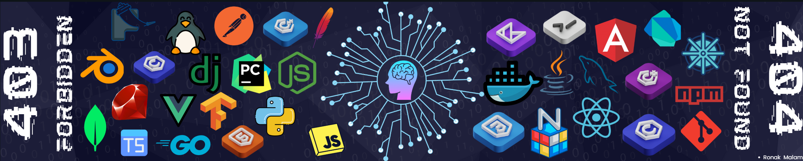


<h1 align="center">Hello There👋🏻 I’m Ronak Malam</h1>
<h3 align="center">A Progressive MERN Developer Building Innovative Solutions</h3>

# 📝 About Me

- <h3>🔭 I’m currently working on Attendance-Management-System Project</h3>
- <h3>💬 Ask me about Python, JavaScript, HTML and CSS</h3>
- <h3>👯 I love to make new connections with people on <a href="https://www.linkedin.com/in/ronak-malam/">LinkedIn</a></h3>
- <h3>📪 Want To Reach Me? <a href="mailto:itzronakmalam94@gmail.com">Email</a></h3>

<!-- 
  
 -->

# ✍️  Dev Quote

# 🌐 Socials:
     

# 💻 Tech Stack:
                                

# 📊 GitHub Stats:
 
 

## 🔝 Top Contributed Repo

  ## 💰 You can help me by Donating
   

<picture>
  <source media="(prefers-color-scheme: dark)" srcset="https://raw.githubusercontent.com/Ronakmalam333/Ronakmalam333/output/github-snake-dark.svg" />
  <source media="(prefers-color-scheme: light)" srcset="https://raw.githubusercontent.com/Ronakmalam333/Ronakmalam333/output/github-snake.svg" />
  
</picture>
